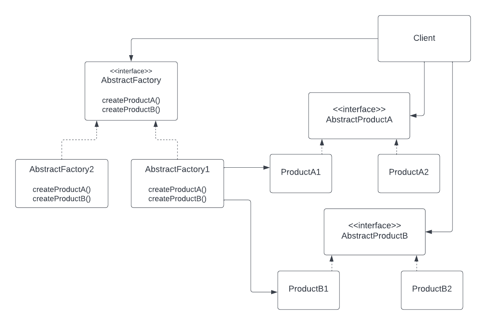
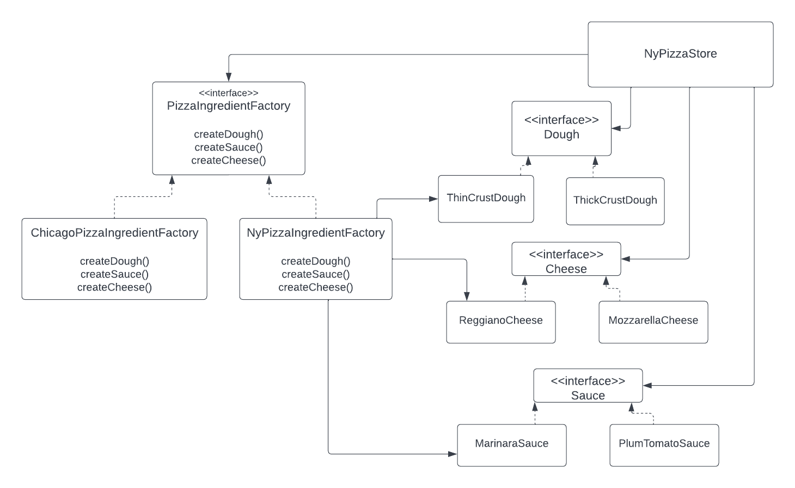

## Abstract Factory pattern
The abstract Factory pattern provides an interface for creating families of related
or dependent objects without specify their concrete classes.

### Abstract Factory class diagram 

### Pizza store app class diagram
This is the class diagram of the pizza store which is based at the abstract factory pattern class diagram.

### bullets points
- Abstract Factory is used to create a family of products. It gives un an interface to create a dependent objects.
- Abstract Factory create objects through composition.
- Factory method create objects through inheritance
- Abstract Factory uses Factory method to implement its concrete factories: for example NyPizzaIngredientFactory 
 implements a factory method createDough() to create ThinCrustDough class which is Dough implementation.
- The intent of Abstract Factory is to create families of related objects without having to depend on their concrete classes.