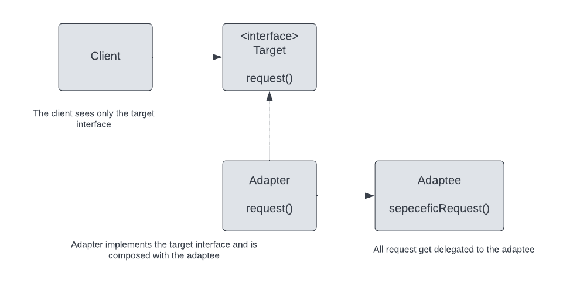

## Adpater design pattern

### Adapter official definition
The Adapter Pattern converts the interface of a class into another interface the clients expects.
Adapter lets classes work together that couldn't otherwise because of incompatible interfaces.

### Class diagram
Here is the class diagram of the Adapter design pattern (Object Adapter)

