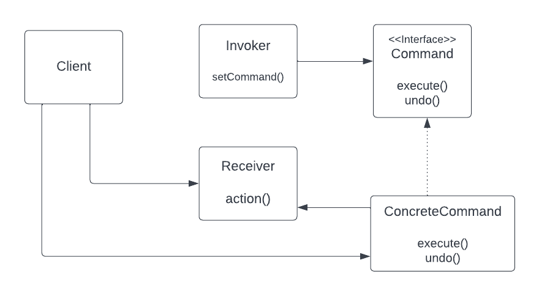
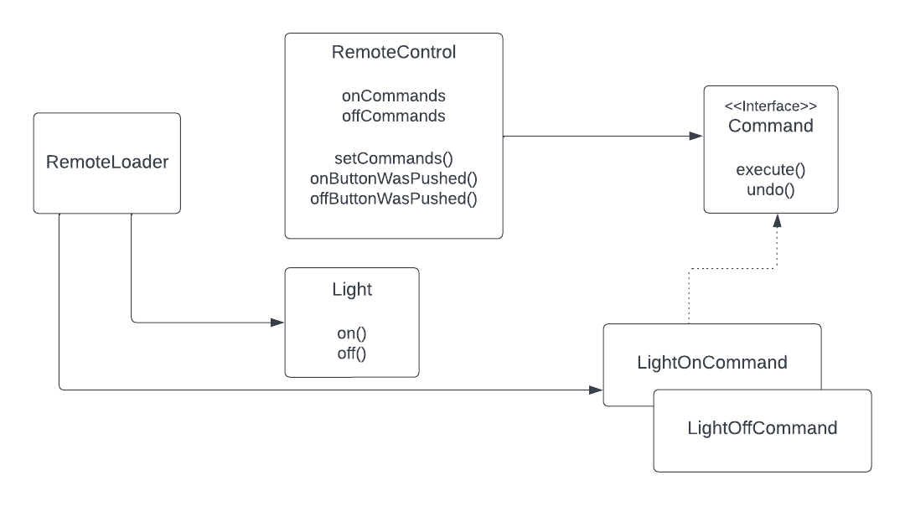

## Command design pattern

The command Pattern encapsulates a request as an object, thereby, letting you parametrize other objects with 
different requests, queue or log requests, and support undoable operations.

### Class diagram 

### Remote control class diagram 
This is the class diagram of the remote control app which is based at the command pattern class diagram.

### Bullet points
- The command pattern decouples an object making a request from the one that knows how to perform it.
- A command object at the centure of this decoupling and encapsulates a receiver with an action or a set of actions.