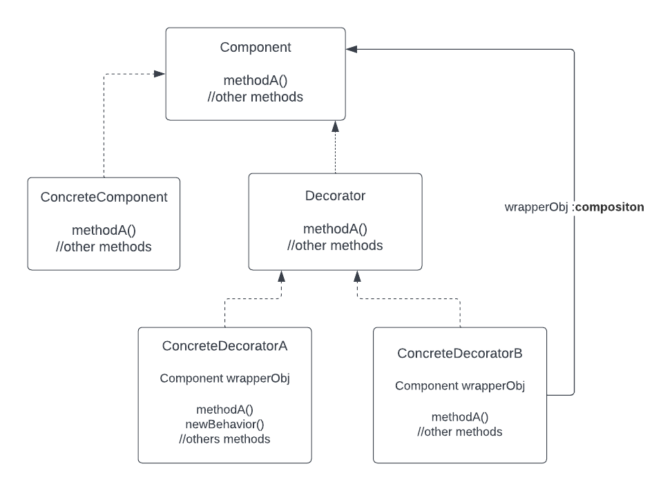
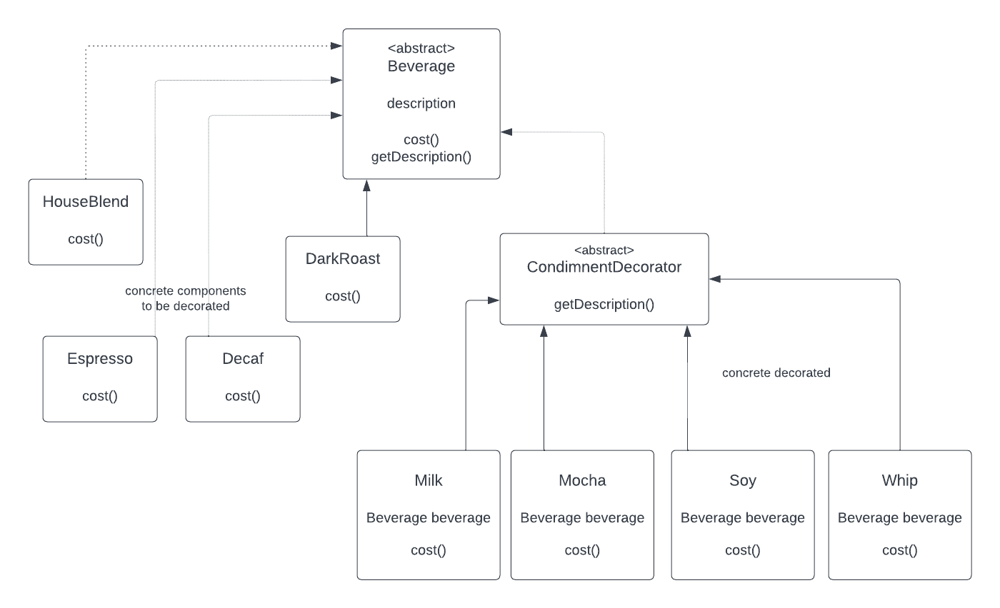
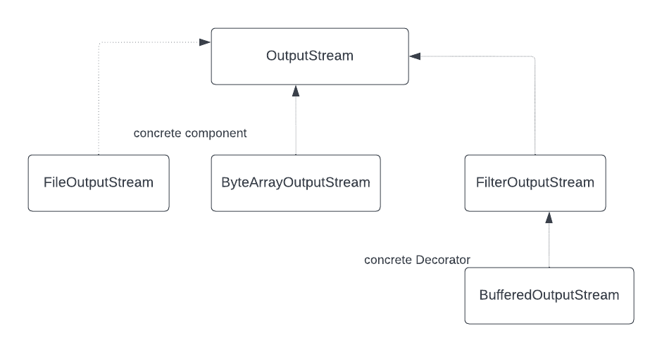

## Decorator design pattern

The Decorator pattern attaches additional responsabilities to an object dynamically.
Decorator provide flexible alternative to subclassing for extending functionality.

### Class diagram 

### Starbuzz coffee class diagram 
This is the class diagram of the starbuzz coffee which is based at the decorator class diagram.

### Java IO : Real world Decorators
The java io package is based at the decorator diagram class. 
we will see here the output classes (same for input classes)

### The Open Closed Design principle
We added new OO design principle with this chapter.

Description: 
Classes should be open for extension but closed for modification.

### Bullet points
- The Decorator pattern provides an alternative to subclassing for extending behavior.
- Composition and delegation can often be used to add new behaviors at runtime.
- The decorator pattern involves a set of decorator classes that are used to wrap concrete components.
