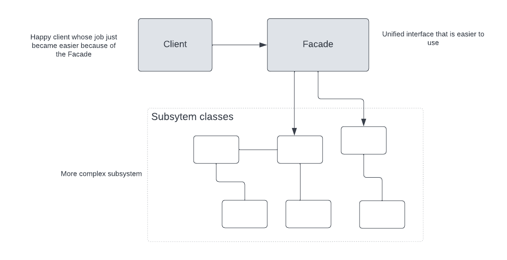

## Facade design pattern

### Facade Pattern official definition
The Facade Pattern provides a unified interface to a set of interfaces 
in a subsystem. Facade defines a higher level interface that makes the 
subsystem easier to use.

### Class diagram 

### Facade pattern applies the design principle Least of Knowledge 
#### Design principle Least of Knowledge
Talk only to your immediate friends.

This principle guides us to reduce the interactions between objects 
to just a few close friends.
From any method of an object, we should only invoke methods that belongs to : 
- The object itself
- Objects passed in as a parameter to the method
- Any object the method creates on instantiates
- Any component of the objects

#### Bullets points: 
- When we need to simplify and unify a large interface or complexe set of interface
we use Facade.
- A Facade decouples client from a complex subsystem.
- An adapter wraps an object to change its interface, a decorator wraps an object
to add new behaviors and responsibilities and a facade wraps a set of objects to 
simplify.