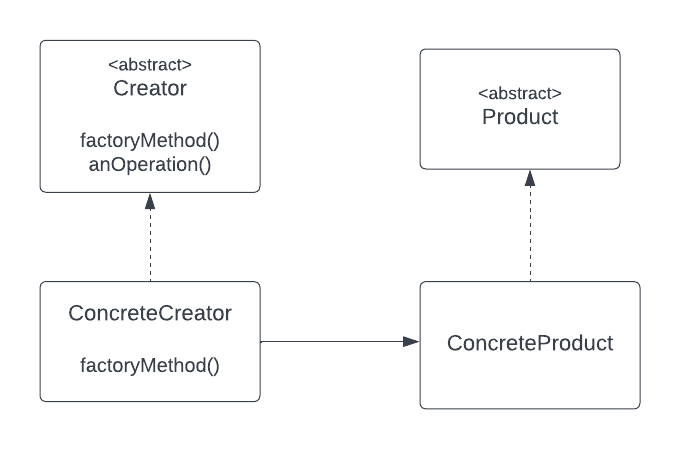
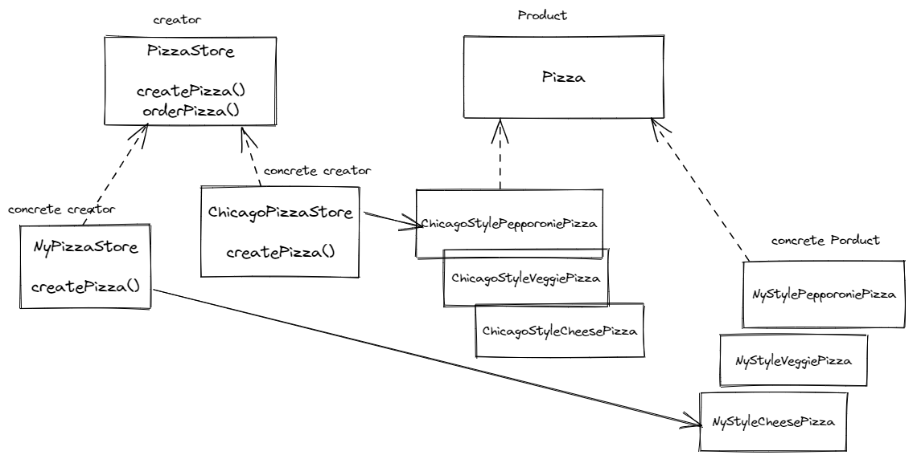

## Factory method pattern
The Factory method pattern defines an interface for creating an object, but lets
subclasses decide which class to instantiate.
Factory method lets classes defer instantiation to subclasses.

### Factory method class diagram

### Pizza store class diagram
This is the class diagram of the pizza store which is based at the factory method 
pattern class diagram.

### The Dependency Inversion Principle (DIP)
Official definition of the design principle: 
Depends upon abstraction, do not depend upon concrete classes.

=> It suggests that our high-level components should not depend on low-level components.
rather they should both depends on abstraction.
for example, in our pizza store application, 
Pizza store is the high-level component and the pizza implementation is the low-level components.
Both of them depend on abstraction which is the pizza abstract class.

### bullets points
- Factory method pattern declares a factory method that will encapsulate object creation which 
apply the first design principle "encapsulate what varies".
- Factory method pattern is a powerful technique for conding to abstraction and not to concrete class(DIP)
- Factory method relies on inheritance: Objects creation is delegated to subclasses which implements the factory method
to create objects.
- The intent of Factory method is to allow a class to defer instantiation to its subclasses.
