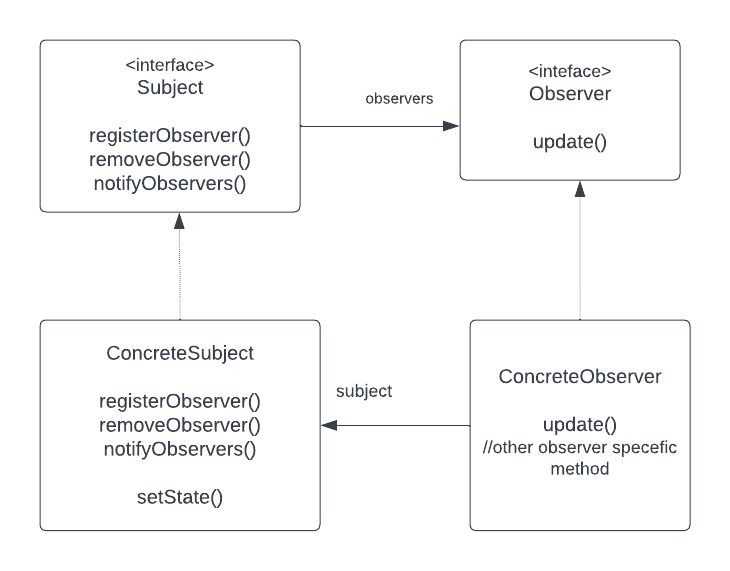
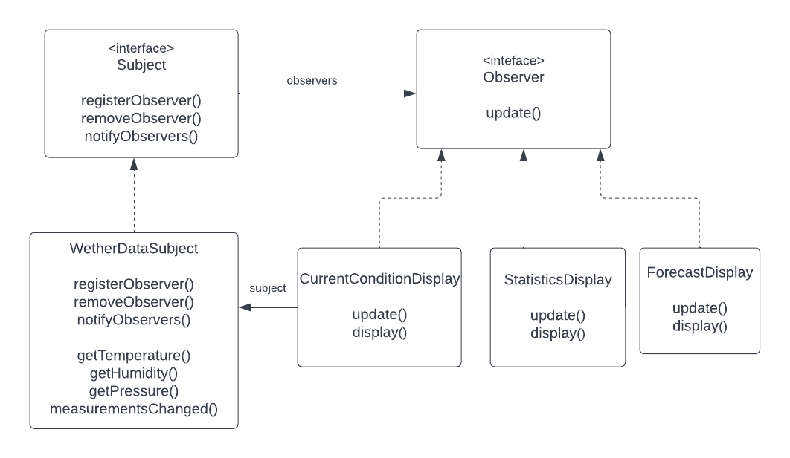

## Observer design pattern

The observer Pattern defines a one-to-many dependency between objects so that when one object changes state, all
of its dependents are notified and updated automatically.

### Class diagram 

### Weather station class diagram
The weather station implemented is based at the observer pattern class diagram with pull type.

#### Bullets points:
- The observer Pattern defines a one-to-many relationship between objects
- Subjects or as we also know them, Observables, update observers using a common interface.
- Observers are loosely coupled in that the observables knows nothing about them,
other than that they implement the observer interface.
- You can push or pull data from the observable when using the pattern.(Pull is considered more correct)